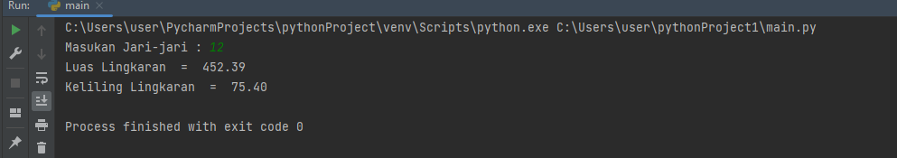

# pratikum3 
### Inayatus Sholekhawati
### 312210200
### TI.22.A.2

### PROGAMAN PYTHON MENGHITUNG LUAS & KELILING LINGKARAN PADA PYTHO

### LUAS LINGKARAN

### Flowchart Menghitung Luas & Keliling Lingkaran

Penjelasan Algoritma menghitung Luas Keliling Lingkaran sebagai berikut;
mulai
Masukan jari-jari
Proses hitungan luas (L) dan keliling (K) lingkaran
Tampilkan luas (L) dan keliling (K) lingkaran
selesai

### Source Code
code progaman untukk menghitung luas lingkaran dalam bahasa bahasa pemorogaman Pyhon:
'''
inmport mth
r = float(input("Masukan Jari-jari : "))

luas = math.pi*(r*r)
keliling = 2*math.pi*r
print ("Luas LIngkaran \t= ",format(luas,'.2f'))
print ("Keliling Lingkaran \t= ",format(keliling '.2f'))
'''

### Output 

Hasil running program untuk mengethui luas Lingkaran dan Keliling Lingkaran dalam bahsa pemrograman Python
1[gambar3](foto/in2.png)

